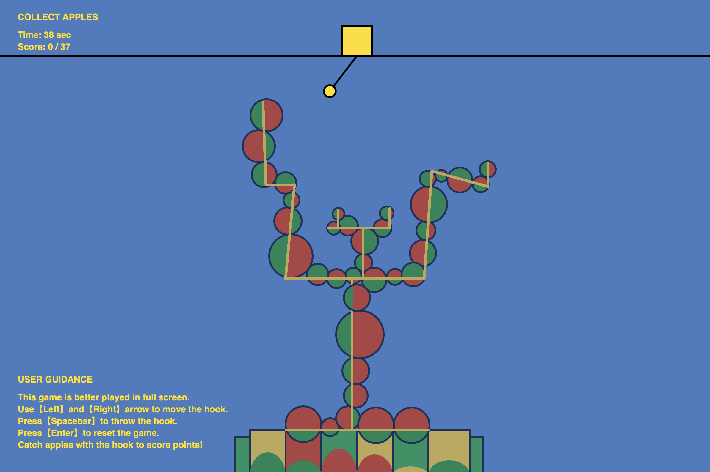

# Apple Catcher Game

**Developed by Luna Xu**

## Description
Apple Catcher is a simple and fun game where you control a hook to catch apples from a tree. Your goal is to collect a certain number of apples to win the game.

## Features
- Realistic apple-catching physics.
- Interactive gameplay with keyboard controls.
- Score tracking.
- Win condition.

## How to Play
1. Use the **Left** and **Right** arrow keys to move the hook.
2. Press the **Spacebar** to throw the hook.
3. Catch apples with the hook to score points.
4. You win the game by reaching the target score.

## Getting Started
To run the game locally using [Visual Studio Code](https://code.visualstudio.com/) and [Live Server](https://marketplace.visualstudio.com/items?itemName=ritwickdey.LiveServer):

1. Open your project folder in Visual Studio Code.
2. Right-click on the `index.html` file.
3. Select "Open with Live Server" to launch the game in your web browser.

## Screenshots

## Credits
- Game developed by **Luna Xu**

## Acknowledgments
- Special thanks to my group members for their contributions.
- Inspiration from [Anwar Jalal Shemza 'Apple Tree'].
